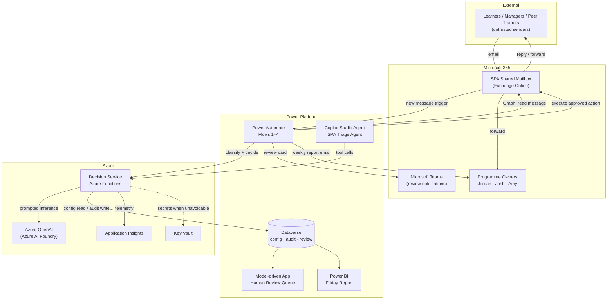
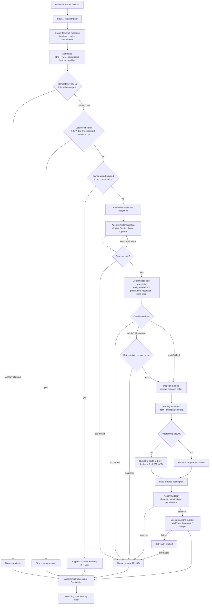
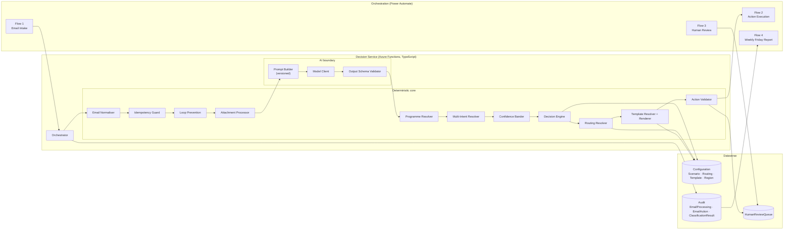
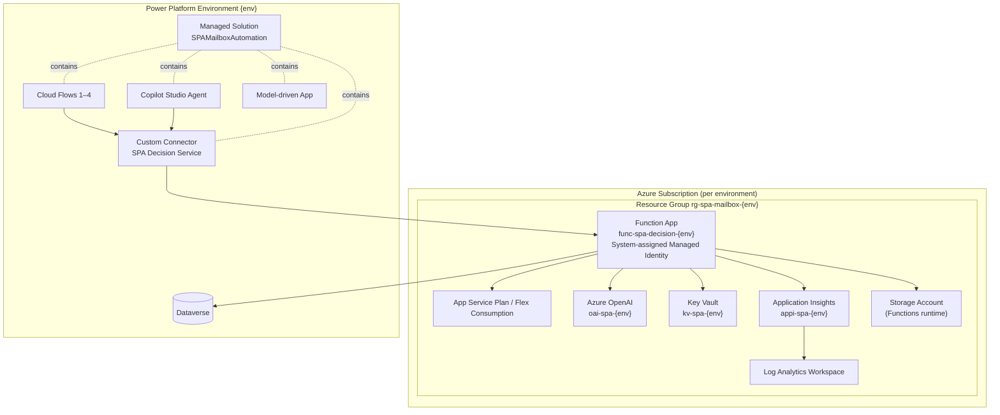
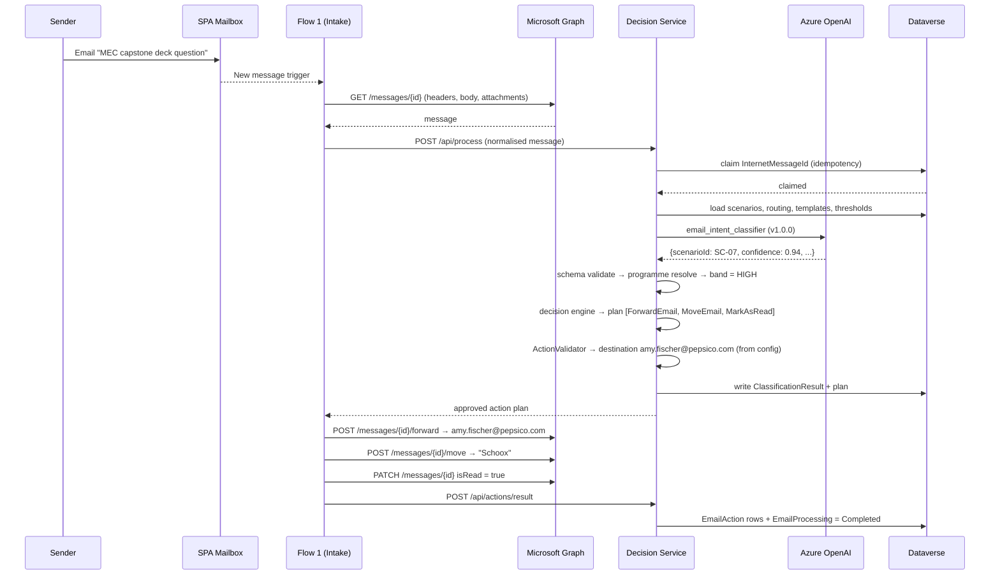
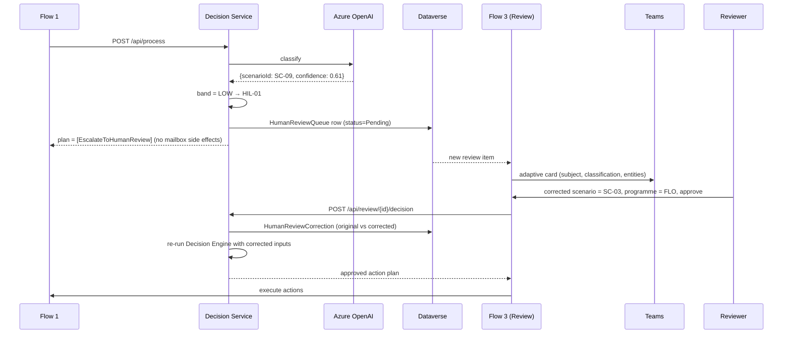

# Solution Architecture
## PEP Passport SPA Box Automation – Agentic (WIT 504)

| Field | Value |
|---|---|
| Document | Architecture (Phase 1 deliverable) |
| Version | 1.0 |
| Depends on | `docs/requirements-analysis.md` |

---

## 1. Architectural principle (mandatory, BRD§28)

```
AI decides WHAT the email means.
Business rules determine WHAT actions are permitted.
Power Automate / Microsoft services EXECUTE the approved action.
Dataverse / Azure services provide STATE, AUDITABILITY and REPORTING.
```

This separation is structural, not advisory. The AI has no credential, no connector, no mailbox
handle and no address book. It receives sanitised text and returns a JSON document. Every
consequential decision — which action, which address, which folder, which template, whether to
send at all — is taken by deterministic code reading configuration.

The practical test: **if the model were fully compromised by a prompt-injection attack, what could
it cause?** Answer: a wrong scenario label, which either fails deterministic corroboration and goes
to human review, or produces an action drawn from the approved set for that scenario, addressed to
an address that came from configuration. It cannot cause mail to be sent to an attacker-chosen
address, cannot cause deletion outside SC-08, and cannot cause arbitrary text to be sent.

---

## 2. Context diagram



---

## 3. Logical flow



---

## 4. Component architecture



### Component responsibilities

| Component | Responsibility | Trust |
|---|---|---|
| Email Normaliser | HTML→text, strip quoted history and signatures, normalise whitespace, cap length. | Deterministic |
| Idempotency Guard | Claim `InternetMessageId` before side effects; detect replays. | Deterministic |
| Loop Prevention | Detect own outbound (`X-SPA-Bot-ProcessingId`, bot sender), auto-submitted headers, reply depth. | Deterministic |
| Attachment Processor | Metadata extraction, extension/MIME allow-list, pluggable content handlers. | Deterministic |
| Prompt Builder | Assemble versioned prompt with delimited, sanitised email content and closed enums. | Deterministic assembly of an AI input |
| Model Client | Azure OpenAI call with timeout, retry, backoff, latency capture. | AI boundary |
| Output Schema Validator | Reject anything not conforming to the classification JSON schema. | Deterministic |
| Programme Resolver | Weighted-evidence FIT/FLO/MEC resolution; applies fallback Rule R-1. | Deterministic |
| Multi-Intent Resolver | Precedence and conflict policy; sets `multiIntent`. | Deterministic |
| Confidence Bander | Band into high/medium/low; per-scenario overrides; destructive-action floor. | Deterministic |
| Decision Engine | Map (scenario, programme, band, entities) → ordered action plan. | Deterministic |
| Routing Resolver | Resolve destination addresses from `RoutingRule` only. | Deterministic |
| Template Resolver | Select template by scenario/programme/sender type; reject inactive; render with allow-listed variables. | Deterministic |
| Action Validator | Final gate: action in scenario's allow-list, destination configured, send/delete permitted. | Deterministic |
| Power Automate Flows | Execute mailbox operations via Graph/Outlook connector. | Deterministic |

---

## 5. Deployment view



Environments: **DEV**, **TEST**, **PROD** — identical topology, different configuration.
No environment-specific value is compiled into any artefact (NFR-021); all are supplied by
Bicep parameter files and Power Platform environment variables.

---

## 6. Sequence — happy path (SC-07, Schoox)



## 7. Sequence — low confidence → human review



---

## 8. Cross-cutting design

### 8.1 Idempotency (FR-070 – FR-072)
Two-key model. `InternetMessageId` is the primary key (globally unique per RFC 5322, survives
folder moves — unlike the Graph `id`, which changes on move). `BodyHash + SenderEmail + Subject`
is the secondary key catching resends that carry a new message id.

The claim is a **conditional insert** on a Dataverse alternate key, executed *before* any side
effect. Concurrency and Power Automate's at-least-once retry are handled by the uniqueness
violation, not by a read-then-write check (which would race).

State machine: `Claimed → Classifying → Decided → Executing → Completed`, with terminal
`Failed`, `HumanReview`, `Suppressed`, `Duplicate`. Only `Claimed` and `Failed` (below max
retries) are resumable; anything else short-circuits a replay.

### 8.2 Loop prevention (FR-073, FR-074)
Four independent checks, any of which halts processing:
1. Sender is the SPA mailbox itself or any configured bot identity.
2. Message carries the `X-SPA-Bot-ProcessingId` internet header stamped on all outbound mail.
3. `Auto-Submitted: auto-*` or `X-Auto-Response-Suppress` header present (also feeds SC-08).
4. Per-conversation outbound counter exceeds `loopPrevention.maxOutboundPerConversation`.

### 8.3 Owner-response suppression (FR-011, GAP-015)
When any configured owner address appears as a **sender** on the conversation, the conversation is
marked suppressed. Subsequent inbound mail on that `conversationId` is marked read and audited but
receives no automated response, forward or move. Scope and expiry are configuration.

### 8.4 Error handling (NFR-001 – NFR-004)
Every outbound dependency call is wrapped with timeout, bounded retries and full-jitter exponential
backoff. Errors are classified `Transient | Permanent | Guardrail`. Transient errors retry;
permanent and guardrail errors go straight to the failure path. Retries exhausted ⇒
`ProcessingError` row + `EscalateToHumanReview` (HIL-08) + alert. **The original email is never
deleted or moved on a failure path**, so nothing is lost (NFR-002).

### 8.5 Observability (NFR-005 – NFR-007)
One `correlationId` spans Flow → Decision Service → model call → action execution. Structured logs
carry the full NFR-005 field list. A redaction layer strips body text, GPID, learner names and
email addresses from telemetry by default; only hashes and lengths are emitted.

### 8.6 Configuration (NFR-015)
Dataverse is the runtime source of configuration; the JSON files in `/config` are the versioned
seed and the offline/test source. A single `ConfigurationStore` interface serves both, so the
engine is identical in test and production. Every threshold, address, folder name, template and
keyword resolves through it — there are no literals in the decision path.

---

## 9. Why not the obvious simpler design

| Simpler option | Why rejected |
|---|---|
| Put all rules in Power Automate conditions | Untestable (violates Rule 10/NFR-018), rules duplicated across flows (violates Rule 3), and business rules become invisible to code review. |
| Let the Copilot Studio agent call Graph directly | Violates Rule 12 and Rule 16 — an injected instruction would reach the mailbox. |
| Let the model write the reply text | Violates BRD§16 and Rule 14. |
| Use the Outlook connector only, no Graph | Cannot reliably read `internetMessageId` or auto-submitted headers, breaking FR-071 and FR-075. |
| Keyword rules engine, no AI | Violates BRD§28 explicitly; cannot handle multi-intent (BRD§7) or non-standard wording. |
| Trust the model's self-reported confidence | Self-reported confidence is not calibrated; the medium band therefore requires deterministic corroboration (AD-006). |

---

## 10. Risks

| ID | Risk | Impact | Mitigation |
|---|---|---|---|
| RSK-01 | Model mis-classifies and mail is auto-sent to the wrong owner. | Medium | Confidence banding, corroboration, shadow-mode pilot, per-scenario send permission. |
| RSK-02 | Prompt injection attempts to redirect routing. | High if unmitigated | Destinations never come from model output (Rule 16); injection detection raises HIL-09. |
| RSK-03 | Duplicate sends from Power Automate retry. | High | Pre-side-effect reservation claim on a unique key. |
| RSK-04 | Blocking gaps (templates, change-request process, region map) never close. | High | Capability ships disabled; the gap is visible in configuration and in the Friday report's `UNMAPPED` bucket. |
| RSK-05 | Azure OpenAI throttling at peak. | Medium | Bounded retry with backoff; on exhaustion the item goes to human review, never silently dropped. |
| RSK-06 | Owner addresses change (staff move). | Medium | Addresses are configuration, changeable without deployment. |
| RSK-07 | Auto-response sent to an external sender inappropriately. | Medium | Outbound domain allow-list; external ⇒ human review by default (GAP-017). |
| RSK-08 | Deleting an OOO message that compliance required retaining. | Medium | Soft delete by default; hard delete requires explicit configuration (GAP-006). |
