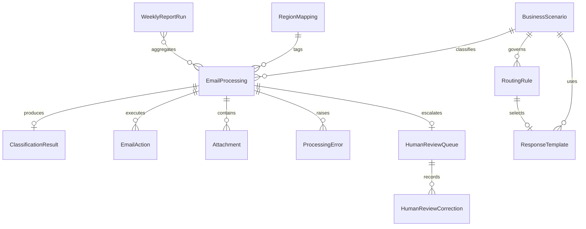
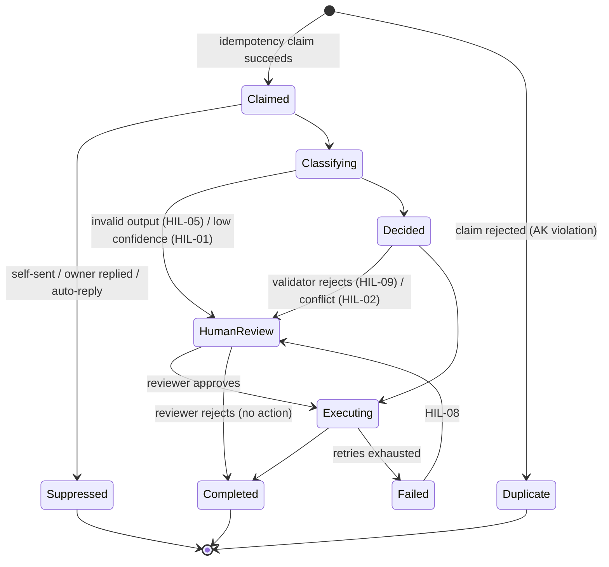

# Data Model
## PEP Passport SPA Box Automation – Agentic (WIT 504)

Platform: **Microsoft Dataverse** (AD-018). Publisher prefix: `spa`.
Tables marked *(AD-011)* are additions beyond the BRD§14 list, each with a stated justification.

Legend — `PK` primary key · `AK` alternate key (uniqueness enforced by the platform) ·
`FK` lookup · `C` choice/optionset · `R` required.

---

## 1. Operational tables

### 1.1 `spa_emailprocessing` — EmailProcessing
The idempotency and audit spine. One row per inbound message. Field list is exactly BRD§14 plus
the marked extensions.

| Column | Type | Keys | Notes |
|---|---|---|---|
| `spa_processingid` | Text(50) | PK, R | GUID generated at claim time (BRD§5 Flow 1.2). |
| `spa_messageid` | Text(500) | R | Microsoft Graph message id. **Changes on folder move** — not usable as the idempotency key. |
| `spa_internetmessageid` | Text(500) | **AK**, R | RFC 5322 Message-ID. Primary idempotency key (FR-071). |
| `spa_conversationid` | Text(500) | | Thread key; drives owner-response suppression (FR-011). |
| `spa_conversationindex` | Text(1000) | | Reply-depth signal for loop prevention. |
| `spa_receiveddatetime` | DateTime | R | |
| `spa_senderemail` | Text(320) | | Personal data. |
| `spa_sendername` | Text(200) | | Personal data. |
| `spa_sendertype` | Choice | C | learner · manager · peer_trainer · hr · internal · external · system · unknown (GAP-007). |
| `spa_subject` | Text(500) | | Truncated per configuration. |
| `spa_bodyhash` | Text(64) | | SHA-256 of normalised body — secondary idempotency key (FR-071). |
| `spa_bodypreview` | Text(2000) | | **Empty unless `storeBodyPreview` is enabled** (NFR-007, AD-012). |
| `spa_attachmentcount` | Whole number | | |
| `spa_hasattachments` | Yes/No | | |
| `spa_scenarioid` | Text(10) | FK→BusinessScenario | |
| `spa_scenarioname` | Text(200) | | Denormalised for reporting. |
| `spa_program` | Choice | C | FIT · FLO · MEC_CGR · ALL · UNKNOWN. |
| `spa_intent` | Text(200) | | |
| `spa_confidence` | Decimal(3,2) | | 0.00–1.00. |
| `spa_confidenceband` | Choice | C | HIGH · MEDIUM · LOW. |
| `spa_multiintent` | Yes/No | | FR-024. |
| `spa_processingstatus` | Choice | C, R | See §4 state machine. |
| `spa_actiontaken` | Text(500) | | Comma-separated executed action names. |
| `spa_routingowner` | Text(200) | | Resolved owner display name. |
| `spa_routingemail` | Text(1000) | | May hold **two** addresses under Rule R-1 (FR-027). |
| `spa_destinationfolder` | Text(200) | | |
| `spa_responsetemplateid` | Text(50) | FK→ResponseTemplate | |
| `spa_humanreviewrequired` | Yes/No | | |
| `spa_humanreviewreason` | Text(200) | | HIL-01…HIL-09 *(AD-011)*. |
| `spa_humanreviewedby` | Lookup(systemuser) | | |
| `spa_humanreviewdate` | DateTime | | |
| `spa_errorcode` | Text(50) | | |
| `spa_errormessage` | Text(2000) | | Redacted. |
| `spa_retrycount` | Whole number | | *(AD-011)* NFR-001. |
| `spa_correlationid` | Text(50) | | *(AD-011)* NFR-005. |
| `spa_regioncode` | Text(50) | FK→RegionMapping | *(AD-011)* FR-090; `UNMAPPED` until GAP-012 closes. |
| `spa_suppressedreason` | Choice | C | *(AD-011)* OwnerResponded · SelfSent · AutoReply · Duplicate. |
| `spa_createddate` | DateTime | R | |
| `spa_completeddate` | DateTime | | |

Indexes: `spa_internetmessageid` (AK, unique), `spa_conversationid`, `spa_receiveddatetime`,
`spa_scenarioid + spa_regioncode` (reporting), `spa_processingstatus`.

### 1.2 `spa_classificationresult` — ClassificationResult
Stores the structured AI output verbatim, for audit and prompt improvement.

| Column | Type | Notes |
|---|---|---|
| `spa_classificationresultid` | PK | |
| `spa_processingid` | FK→EmailProcessing, R | |
| `spa_rawoutput` | Text(8000) | The validated JSON document. **Never contains chain-of-thought** (Rule 11). |
| `spa_reasoningsummary` | Text(1000) | Short, business-readable (FR-023). |
| `spa_promptname` | Text(100) | e.g. `email_intent_classifier`. |
| `spa_promptversion` | Text(20) | Semver of the prompt file (NFR-017). |
| `spa_modelname` | Text(100) | Deployment name. |
| `spa_modelversion` | Text(50) | |
| `spa_latencyms` | Whole number | NFR-005. |
| `spa_prompttokens` / `spa_completiontokens` | Whole number | Cost and capacity tracking. |
| `spa_schemavalid` | Yes/No | FR-021. |
| `spa_repairattempted` | Yes/No | AD-020. |
| `spa_secondaryintents` | Text(1000) | JSON array — supports FR-024. |
| `spa_injectiondetected` | Yes/No | HIL-09. |
| `spa_createddate` | DateTime | |

### 1.3 `spa_emailaction` — EmailAction *(AD-011)*
**Justification:** FR-013 requires an auditable record of *every action*. `EmailProcessing` has one
row per email and a single `ActionTaken` text field, which cannot record per-action outcome,
timing, retry or failure. Without this table the audit requirement cannot be met.

| Column | Type | Notes |
|---|---|---|
| `spa_emailactionid` | PK | |
| `spa_processingid` | FK→EmailProcessing, R | |
| `spa_sequence` | Whole number, R | Execution order within the plan. |
| `spa_actiontype` | Choice, R | The nine approved actions (FR-040…FR-048). |
| `spa_actionparameters` | Text(4000) | Validated parameters, redacted. |
| `spa_resolveddestination` | Text(1000) | Address/folder actually used — proves it came from config (Rule 16). |
| `spa_status` | Choice, R | Planned · Approved · Rejected · Executing · Succeeded · Failed · Skipped. |
| `spa_rejectionreason` | Text(500) | ActionValidator verdict when rejected. |
| `spa_attemptcount` | Whole number | |
| `spa_graphrequestid` | Text(100) | Graph `request-id` for support escalation. |
| `spa_startedat` / `spa_completedat` | DateTime | |

### 1.4 `spa_attachment` — Attachment *(AD-011)*
**Justification:** FR-080 requires attachment metadata capture; the BRD entity list has no table for it.

| Column | Type | Notes |
|---|---|---|
| `spa_attachmentid` | PK | |
| `spa_processingid` | FK→EmailProcessing, R | |
| `spa_graphattachmentid` | Text(500) | FR-080. |
| `spa_filename` | Text(500) | **Untrusted** — sanitised before storage/display (NFR-013). |
| `spa_extension` | Text(20) | Derived, lower-cased. |
| `spa_mimetype` | Text(200) | |
| `spa_sizebytes` | Whole number | |
| `spa_isinline` | Yes/No | Inline images are excluded from "has meaningful attachment". |
| `spa_supported` | Yes/No | Against the configured allow-list (FR-082). |
| `spa_handlerapplied` | Text(100) | Null unless a content handler ran (FR-083). |
| `spa_handleroutput` | Text(4000) | Null by default; OCR is off (GAP-019). |

### 1.5 `spa_processingerror` — ProcessingError

| Column | Type | Notes |
|---|---|---|
| `spa_processingerrorid` | PK | |
| `spa_processingid` | FK→EmailProcessing | |
| `spa_stage` | Choice | Ingest · Normalise · Classify · Decide · Validate · Execute · Audit · Report. |
| `spa_errorcategory` | Choice | Transient · Permanent · Guardrail. |
| `spa_errorcode` / `spa_errormessage` | Text | Redacted. |
| `spa_attemptnumber` / `spa_maxattempts` | Whole number | NFR-001. |
| `spa_nextretryat` | DateTime | Backoff schedule. |
| `spa_deadlettered` | Yes/No | NFR-004. |
| `spa_alertraised` | Yes/No | NFR-003. |

### 1.6 `spa_humanreviewqueue` — HumanReviewQueue *(AD-011)*
**Justification:** BRD§10 requires a human review mechanism with specific reviewer capabilities; no
table is listed for it.

| Column | Type | Notes |
|---|---|---|
| `spa_humanreviewqueueid` | PK | |
| `spa_processingid` | FK→EmailProcessing, R | |
| `spa_triggerreason` | Choice, R | HIL-01…HIL-09 (FR-060). |
| `spa_status` | Choice, R | Pending · InReview · Approved · Rejected · Corrected · Expired. |
| `spa_priority` | Choice | |
| `spa_assignedto` | Lookup(systemuser) | |
| `spa_proposedplan` | Text(4000) | The action plan awaiting approval (FR-063). |
| `spa_originalmessagelink` | URL | Deep link to the message in Outlook (FR-061). |
| `spa_slaDueBy` | DateTime | GAP-008. |
| `spa_reviewedat` | DateTime | |

### 1.7 `spa_humanreviewcorrection` — HumanReviewCorrection *(AD-011)*
**Justification:** FR-064 requires corrections be recorded for model/prompt improvement. Needs a
before/after grain that the queue table does not provide.

| Column | Type | Notes |
|---|---|---|
| `spa_humanreviewcorrectionid` | PK | |
| `spa_humanreviewqueueid` | FK, R | |
| `spa_field` | Choice, R | Scenario · Program · Routing · Template · Action · SenderType. |
| `spa_originalvalue` / `spa_correctedvalue` | Text(500) | |
| `spa_correctionnote` | Text(2000) | |
| `spa_promptversion` | Text(20) | Which prompt version produced the error. |
| `spa_correctedby` | Lookup(systemuser) | |

### 1.8 `spa_weeklyreportrun` — WeeklyReportRun *(AD-011)*
**Justification:** FR-098 requires automatic generation; the run itself needs an audit trail.

| Column | Type | Notes |
|---|---|---|
| `spa_weeklyreportrunid` | PK | |
| `spa_periodstart` / `spa_periodend` | DateTime, R | |
| `spa_generatedat` | DateTime | |
| `spa_status` | Choice | Succeeded · Failed · PartialUnmapped. |
| `spa_totalemails` | Whole number | |
| `spa_unmappedregioncount` | Whole number | Surfaces GAP-012 to the business every week. |
| `spa_payload` | Text(50000) | JSON report body. |
| `spa_recipients` | Text(2000) | GAP-014. |

---

## 2. Configuration tables

### 2.1 `spa_businessscenario` — BusinessScenario
Holds SC-01…SC-12 plus SC-99. Field list per BRD§13.

| Column | Type | Notes |
|---|---|---|
| `spa_scenarioid` | Text(10), **AK** | `SC-01`… |
| `spa_scenarioname` | Text(200), R | |
| `spa_description` | Text(2000) | Semantic description used in the prompt (BRD§13). |
| `spa_keywords` | Text(4000) | JSON array — evidence signals, not the classifier. |
| `spa_positiveexamples` / `spa_negativeexamples` | Text(4000) | JSON arrays; few-shot source (BRD§11, Phase 5). |
| `spa_programscope` | Choice | FIT_FLO · MEC_CGR · ANY. |
| `spa_allowedactions` | Text(500) | JSON array — the per-scenario action allow-list (FR-031). |
| `spa_sendresponseallowed` | Yes/No, R | Rule 14 gate. Default **No** (AD-002). |
| `spa_deleteallowed` | Yes/No, R | Rule 15 gate. **Yes for SC-08 only.** |
| `spa_requiresprogram` | Yes/No | Drives HIL-03. |
| `spa_confidencethresholdoverride` | Decimal(3,2) | Per-scenario override (§9). |
| `spa_escalationrule` | Text(2000) | JSON. |
| `spa_precedence` | Whole number | Multi-intent precedence (§7). |
| `spa_isactive` | Yes/No, R | |

### 2.2 `spa_routingrule` — RoutingRule

| Column | Type | Notes |
|---|---|---|
| `spa_routingruleid` | PK | |
| `spa_scenarioid` | FK, R | |
| `spa_program` | Choice, R | FIT · FLO · MEC_CGR · ALL · UNKNOWN. |
| `spa_subintent` | Text(50) | `change_request` / `technical` for SC-03, SC-05, SC-09. |
| `spa_ownername` | Text(200) | |
| `spa_owneremail` | Text(1000), R | **The only source of routing addresses** (Rule 16). Semicolon-separated for Rule R-1. |
| `spa_routingtarget` | Choice, R | PROGRAM_OWNER · CHANGE_REQUEST · SCHOOX_OWNER · HUMAN_REVIEW · NONE. |
| `spa_destinationfolder` | Text(200) | Null ⇒ no move (GAP-005). |
| `spa_responsetemplateid` | FK | |
| `spa_actiontype` | Text(500) | Ordered JSON array forming the action plan. |
| `spa_confidencethreshold` | Decimal(3,2) | |
| `spa_priority` | Whole number | Resolution order when several rules match. |
| `spa_isactive` | Yes/No, R | |

Uniqueness: (`scenarioId`, `program`, `subIntent`, `priority`).

### 2.3 `spa_responsetemplate` — ResponseTemplate
Field list verbatim from BRD§12, plus the variable allow-list needed to satisfy BRD§16.

| Column | Type | Notes |
|---|---|---|
| `spa_templateid` | Text(50), **AK**, R | |
| `spa_scenarioid` | FK, R | |
| `spa_program` | Choice, R | |
| `spa_sendertype` | Choice, R | GAP-007. |
| `spa_templatetype` | Choice, R | Acknowledgement · Troubleshooting · ChangeRequest · Escalation. |
| `spa_subjecttemplate` | Text(500), R | |
| `spa_bodytemplate` | Text(20000), R | **Placeholder pending GAP-004.** |
| `spa_allowedvariables` | Text(1000) | JSON array *(AD-011)* — enforces BRD§16's "approved variables". |
| `spa_isactive` | Yes/No, R | **Default No.** An inactive template cannot be sent — code-enforced. |
| `spa_version` | Text(20), R | |
| `spa_effectivedate` | DateTime, R | |
| `spa_lastmodifieddate` | DateTime, R | |
| `spa_approvedby` | Text(200) | *(AD-011)* Who approved the wording (BRD§16 "approved templates"). |

### 2.4 `spa_regionmapping` — RegionMapping *(AD-011)*
**Justification:** FR-097. **Ships empty** — the mapping is "To be Provided by Amy" (GAP-012).

| Column | Type | Notes |
|---|---|---|
| `spa_regionmappingid` | PK | |
| `spa_matchtype` | Choice, R | SenderDomain · SenderAddress · LearnerLocation · DistributionList · Custom — flexible because the region *key* is itself unknown (ASM-09). |
| `spa_matchvalue` | Text(500), R | |
| `spa_regioncode` | Text(50), R | |
| `spa_regionname` | Text(200), R | |
| `spa_priority` | Whole number | |
| `spa_isactive` | Yes/No | |

Unmatched messages resolve to `UNMAPPED` and are reported as such — never guessed (FR-097).

### 2.5 `spa_configuration` — Configuration
Single key/value store for thresholds and application settings (FR-030, BRD§13).

| Column | Type | Notes |
|---|---|---|
| `spa_configurationid` | PK | |
| `spa_key` | Text(200), **AK**, R | Dotted path, e.g. `confidence.highThreshold`. |
| `spa_value` | Text(4000), R | JSON-encoded. |
| `spa_datatype` | Choice, R | string · number · boolean · json. |
| `spa_category` | Choice | Confidence · Routing · Safety · Reporting · Retry · Attachment · Feature. |
| `spa_description` | Text(1000), R | Business-readable — this table is a business-facing surface. |
| `spa_environment` | Choice | ALL · DEV · TEST · PROD. |
| `spa_isactive` | Yes/No, R | |

---

## 3. Entity relationships

---

## 4. Processing state machine

Only `Claimed` and `Failed` are resumable on replay; every other state short-circuits, which is
what makes Power Automate's at-least-once delivery safe (FR-072).

---

## 5. Data protection (AD-012, GAP-009)

| Data | Classification | Default handling |
|---|---|---|
| Email body | Confidential, may contain personal data | **Hashed** (`BodyHash`); preview stored only if `storeBodyPreview` is enabled. |
| Subject | Confidential | Stored, truncated. |
| GPID | Personal identifier | Stored in entities; **redacted from all telemetry**. |
| Learner name | Personal data | Stored in entities; redacted from telemetry. |
| Sender address | Personal data | Stored; redacted from telemetry (hash only). |
| Attachment content | Unknown | **Not stored.** Metadata only (FR-080). |
| Model prompt/response | Derived confidential | Response stored; the prompt is not stored, only its name and version. |

Retention: **not defined** (GAP-009). The model supports a scheduled purge job keyed on
`spa_createddate` once a period is supplied; no purge is enabled by default.
