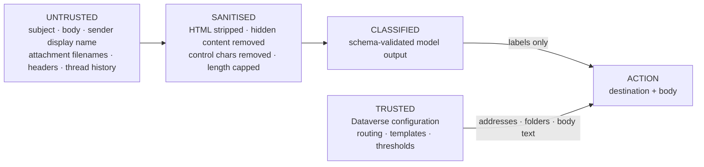

# Security Design
## PEP Passport SPA Box Automation – Agentic (WIT 504)

Covers BRD§21 (security), BRD§Phase 7 (security testing), NFR-008 – NFR-014, Rules 4, 12, 13, 16.

---

## 1. Identity and authentication (NFR-008)

All authentication is via **Microsoft Entra ID**. No shared secrets, no basic auth, no API keys in
source (Rule 4, NFR-009).

| Principal | Type | Used for |
|---|---|---|
| `func-spa-decision-{env}` | System-assigned Managed Identity | Function App → Azure OpenAI, Dataverse, Key Vault, App Insights |
| `SPA-Mailbox-Automation-{env}` | Entra app registration | Microsoft Graph mailbox operations |
| Power Automate connection references | Entra (per-connector) | Outlook, Dataverse, Teams connections |
| Copilot Studio agent | Entra | Authenticated agent access |
| Reviewers | Entra group `SPA-Mailbox-Reviewers-{env}` | Model-driven review app |

**Managed Identity is used wherever the service supports it** (NFR-010). Key Vault holds only what
cannot be managed-identity based; today that is the Application Insights connection string and any
third-party value introduced later. There are zero secrets in the repository — enforced in CI by a
secret scan.

---

## 2. Microsoft Graph permissions (NFR-012)

The mailbox operations required by FR-002, FR-007 – FR-010 and FR-044.

| Permission | Type | Required for | Justification |
|---|---|---|---|
| `Mail.ReadWrite` | Application | Read message, mark read, move, delete | FR-002, FR-009, FR-010, FR-044 |
| `Mail.Send` | Application | Send templated reply, forward | FR-007, FR-008 |
| `User.Read.All` | Application | Resolve sender/owner directory attributes (sender-type classification) | FR-029, GAP-007 |
| `Mail.ReadBasic.All` | Application | *Not requested* — superseded by scoped `Mail.ReadWrite` | — |

### Application Access Policy — mandatory (NFR-011)

`Mail.ReadWrite` and `Mail.Send` as *application* permissions grant tenant-wide mailbox access by
default. That is unacceptable least-privilege. An **Exchange Application Access Policy** must scope
the app registration to a mail-enabled security group containing **only the SPA shared mailbox**:

```powershell
# Run by an Exchange administrator, per environment.
New-DistributionGroup -Name "SPA-Automation-Scope-{env}" -Type Security `
    -Members "<spa-shared-mailbox-upn>"                       # GAP-013: UPN required

New-ApplicationAccessPolicy `
    -AppId "<entra-app-id>" `
    -PolicyScopeGroupId "SPA-Automation-Scope-{env}" `
    -AccessRight RestrictAccess `
    -Description "Restrict SPA Mailbox Automation to the SPA shared mailbox only"

Test-ApplicationAccessPolicy -Identity "<some-other-mailbox>" -AppId "<entra-app-id>"  # must DENY
```

**Deployment gate:** the `Test-ApplicationAccessPolicy` denial check is a mandatory item on the
production checklist. Without it, a compromise of the Function App exposes every mailbox in the
tenant, not one.

### Dataverse security roles

| Role | Tables | Rights |
|---|---|---|
| `SPA Automation Service` | operational tables | Create, Read, Write |
| `SPA Automation Service` | configuration tables | **Read only** — the service must never rewrite its own rules |
| `SPA Reviewer` | HumanReviewQueue, HumanReviewCorrection | Create, Read, Write |
| `SPA Reviewer` | EmailProcessing, ClassificationResult, Attachment | Read |
| `SPA Configuration Admin` | configuration tables | Create, Read, Write, Delete |
| `SPA Report Reader` | operational tables | Read |

The service principal being read-only on configuration is the control that makes "AI cannot change
the rules" true at the platform layer, not just in code.

---

## 3. Threat model

| # | Threat | Vector | Impact | Control |
|---|---|---|---|---|
| T-01 | **Prompt injection** — email instructs the agent to forward elsewhere | Body, subject, attachment filename | Data exfiltration | Destinations resolve from `RoutingRule` only (Rule 16). Detection sets HIL-09. Model output for address fields is discarded. **Structurally impossible to exploit for routing.** |
| T-02 | **Instruction injection via HTML** | Hidden text, white-on-white, zero-size, `display:none`, comments | Manipulated classification | Sanitiser removes hidden content and comments before the model sees it. |
| T-03 | **HTML/script injection into an outbound reply** | Sender content echoed into a template variable | XSS in a recipient's client | Template variables are HTML-encoded on render; raw HTML is never interpolated; renderer rejects unknown variables. |
| T-04 | **Malicious attachment filename** | `../../etc/passwd`, `report.pdf.exe`, RTLO override `‮` | Path traversal, spoofed extension, log injection | Filenames sanitised: path separators stripped, bidi/control characters removed, extension taken from the final segment, length capped. Filenames are never used as filesystem paths. |
| T-05 | **Mail loop** — automation replies to its own reply | Outbound reply re-enters the mailbox | Runaway send, mailbox flooding | Four-check loop prevention (§8.2 of architecture): bot sender, `X-SPA-Bot-ProcessingId` header, auto-submitted headers, per-conversation outbound cap. |
| T-06 | **Mail bomb / DoS** | High-volume sends to the mailbox | Cost, quota exhaustion | Per-sender and per-conversation rate limits; body length cap; bounded `max_tokens`; Azure OpenAI quota. Excess goes to human review, never dropped. |
| T-07 | **Data leakage through model output** | Model echoes internal config or another learner's data into a reply | Confidentiality breach | Outbound text is template-only (BRD§16). Model output never reaches a recipient verbatim. Prompts carry no directory data or address list. |
| T-08 | **Privilege escalation via the agent** | Agent asked to call a connector it should not have | Unauthorised mailbox access | Agent has one connector; no Outlook/Dataverse-write/HTTP connection exists to escalate to. |
| T-09 | **Sender spoofing** | Forged `From:` claiming to be an owner | Wrongful suppression of processing (FR-011) | Owner-response detection uses authenticated Graph sender identity, not the display name or the `From` header text. |
| T-10 | **Replay / duplicate send** | Power Automate retry, duplicate trigger | Duplicate emails to owners | Pre-side-effect idempotency claim on a unique alternate key. |
| T-11 | **Unauthorised configuration change** | Compromised service identity rewrites routing addresses | Silent redirection of all mail | Service principal is **read-only** on configuration tables; changes require `SPA Configuration Admin` and are captured by Dataverse auditing. |
| T-12 | **Secret exposure** | Secret committed to git, or logged | Credential compromise | Managed identity; no secrets in repo; CI secret scan; redaction layer on all telemetry. |
| T-13 | **Log-based PII leakage** | Body or GPID written to App Insights | Privacy breach (NFR-007) | Redaction layer applied at the logger, not at call sites — call sites cannot forget. |
| T-14 | **Malicious attachment content** | Weaponised document | Endpoint compromise | Attachment **content is never downloaded, opened, or executed** — metadata only (FR-080/082). Content handlers are off by default and allow-listed by MIME type. |
| T-15 | **Model output claiming an unsupported action** | Model returns `"recommendedAction": "TransferFunds"` | Unpredictable behaviour | Output enum validation, then `ActionValidator` allow-list. Unknown value ⇒ HIL-09, no execution. |
| T-16 | **Over-broad Graph consent** | App consented tenant-wide | Access to every mailbox | Application Access Policy (§2), verified at deployment. |

---

## 4. Input trust model (Rule 13)



**Nothing crosses from the untrusted lane into an address, a folder name, or outbound body text.**
Untrusted content contributes labels and extracted entity values; entity values may populate
template variables **only** when they appear in that template's `allowedVariables` list and pass
format validation and HTML encoding.

---

## 5. Secrets management (NFR-009, NFR-010, Rule 4)

| Value | Storage |
|---|---|
| Azure OpenAI endpoint | App setting (not a secret) |
| Azure OpenAI auth | **Managed Identity** — no key issued |
| Dataverse URL | App setting |
| Dataverse auth | **Managed Identity** |
| App Insights connection string | Key Vault reference |
| Mailbox UPN | App setting / Power Platform environment variable |
| Owner email addresses | **Dataverse configuration** — business data, not secrets |

Repository controls: `.gitignore` covers `local.settings.json`, `*.env`, `*.pfx`, `*.pem`;
CI runs a secret scan and fails the build on a hit; no `local.settings.json` is committed.

---

## 6. Network and data residency

- Function App: HTTPS only, TLS 1.2 minimum, FTPS disabled.
- Decision Service endpoints require Entra authentication; the custom connector uses
  Entra-authenticated calls. No anonymous endpoint exists.
- Private endpoints for Azure OpenAI and Key Vault are **recommended for PROD** and included as a
  Bicep parameter (`enablePrivateEndpoints`).
- Data residency: Azure OpenAI region is a deployment parameter. **GAP-009 must be closed before
  any real email content is sent to the model.**

---

## 7. Security test coverage (BRD Phase 7)

Implemented in `tests/security/`. Every threat above has at least one executable test.

| Test area | Threat | Assertion |
|---|---|---|
| Prompt injection — routing override | T-01 | Injected address never appears in the resolved destination. |
| Prompt injection — action override | T-01, T-15 | Injected action never executes; item goes to human review. |
| Hidden HTML instruction | T-02 | Hidden text removed before prompt assembly. |
| HTML injection into template | T-03 | Rendered body contains encoded entities, no live markup. |
| Unknown template variable | T-03 | Render rejected. |
| Malicious filename — traversal | T-04 | Path separators removed. |
| Malicious filename — RTLO/bidi | T-04 | Control characters removed; extension resolved correctly. |
| Loop — self-sent message | T-05 | Processing suppressed. |
| Loop — bot header present | T-05 | Processing suppressed. |
| Rate limit — conversation cap | T-06 | Outbound blocked past the cap. |
| Model proposes unapproved action | T-15 | Rejected by `ActionValidator`. |
| Model proposes unconfigured address | T-01 | Rejected; configured address used. |
| Send with inactive template | GAP-004 | Send blocked. |
| Delete outside SC-08 | Rule 15 | Rejected. |
| Send when scenario forbids | Rule 14 | Rejected. |
| Telemetry redaction | T-13 | No body, GPID, or address in log output. |
| Chain-of-thought leakage | Rule 11 | `reasoningSummary` length-capped; no reasoning field passes through. |
| External recipient | GAP-017 | Outbound to a non-allow-listed domain blocked. |

---

## 8. Compliance items requiring business sign-off

| Item | Status |
|---|---|
| Lawful basis for storing GPID and learner names | **Open — GAP-009** |
| Approval to send email content to Azure OpenAI | **Open — GAP-009, blocking** |
| Data-retention period and purge schedule | **Open — GAP-009** |
| Deletion policy for SC-08 vs mailbox retention/eDiscovery | **Open — GAP-006** |
| Exchange Application Access Policy applied and verified | **Open — deployment gate** |
| DPIA / privacy review | **Open** |
| Whether automated replies may go to external recipients | **Open — GAP-017** |
