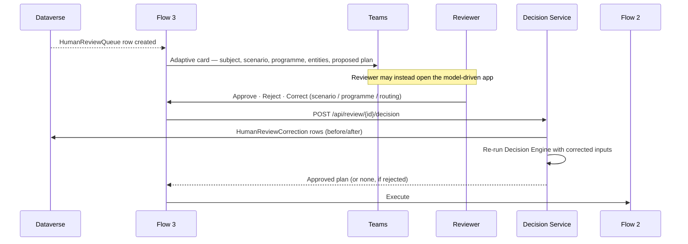

# Solution Design
## PEP Passport SPA Box Automation – Agentic (WIT 504)

How the architecture is realised as running Power Automate flows, a Decision Service, and a
Copilot Studio agent. Read after `docs/architecture.md`.

---

## 1. Flow inventory

| Flow | Trigger | Purpose | BRD |
|---|---|---|---|
| **Flow 1 — Email Intake** | New mail in the SPA shared mailbox | Capture, guard, classify, decide | BRD§5 Flow 1 |
| **Flow 2 — Action Execution** | Called by Flow 1 (child flow) | Execute the approved action plan | BRD§4 Phase 4 |
| **Flow 3 — Human Review** | Dataverse row created in `HumanReviewQueue`; reviewer response | Notify, collect decision, resume | BRD§10 |
| **Flow 4 — Weekly Friday Report** | Recurrence, Fridays | Aggregate and distribute | BRD§19 |
| **Flow 5 — Retry / Dead-letter Sweeper** | Recurrence, every N minutes | Resume retryable failures, dead-letter the rest | BRD§22 |

---

## 2. Flow 1 — Email Intake

Implements BRD§5 Flow 1 steps 1–10 in order.

| Step | BRD§5 | Action | Notes |
|---|---|---|---|
| 1 | trigger | *When a new email arrives in a shared mailbox (V2)* | `includeAttachments: true`, `folderPath: Inbox`, `onlyWithAttachments: false` |
| 2 | 1.1 | `HTTP with Microsoft Entra ID (preauthorized)` → `GET /users/{mailbox}/messages/{id}?$select=…&$expand=attachments` | Graph gives `internetMessageId` and `internetMessageHeaders`, which the connector trigger does not reliably expose (AD-021). |
| 3 | 1.2 | Compose `correlationId` (GUID) | NFR-005 |
| 4 | 1.3–1.5 | `POST {DecisionService}/api/process` | The Decision Service performs the processing-ID generation, duplicate check, automated-message identification, classification and validation as one transactional unit. |
| 5 | 1.6–1.8 | *(inside the Decision Service)* | Keeps the guards atomic with the idempotency claim — splitting them across flow actions would reintroduce the race that the claim exists to remove. |
| 6 | 1.9 | Switch on `decision.outcome` | `EXECUTE` → Flow 2 · `HUMAN_REVIEW` → queue row (Flow 3 picks it up) · `SUPPRESS` → mark read only · `DUPLICATE` → terminate |
| 7 | 1.10 | `POST {DecisionService}/api/actions/result` | Audit write (FR-013) |

**Configure-run-after** on every scope so that a failure routes to the failure handler rather than
terminating the run silently (NFR-002). Trigger concurrency is set to 1 during the pilot to make
ordering deterministic; the idempotency claim makes higher concurrency safe afterwards.

### Why the guards live in the Decision Service, not in flow actions
BRD§5 lists duplicate checking and automated-message identification as flow steps. Implementing
them as separate Power Automate actions would mean a Dataverse read, then a gap, then a write —
during which a retry of the same trigger can pass the same check. Executing them inside a single
service call, behind a conditional insert on a unique key, makes duplicate processing impossible
rather than unlikely (FR-070). The BRD's *logical* sequence is preserved exactly; only the
execution boundary differs. Recorded as **AD-022**.

---

## 3. Flow 2 — Action Execution

Receives a **validated, ordered** action plan. It performs no decisioning: every parameter is
already resolved and approved. It is a child flow so that it can be retried independently.

| Action | Graph / connector call |
|---|---|
| `SendResponse` | `POST /users/{mailbox}/messages/{id}/reply` with the rendered template, plus the `X-SPA-Bot-ProcessingId` internet header |
| `ForwardEmail` | `POST /users/{mailbox}/messages/{id}/forward` — `toRecipients` from the plan (config-derived) |
| `MoveEmail` | `POST /users/{mailbox}/messages/{id}/move` — `destinationId` resolved from the folder map |
| `MarkAsRead` | `PATCH /users/{mailbox}/messages/{id}` `{ "isRead": true }` |
| `DeleteEmail` | `POST …/move` → `deleteditems` (soft, default) or `DELETE /messages/{id}` (hard, only if configured) — GAP-006 |
| `RouteToChangeRequest` | Strategy-driven: reply with link, forward to the CR mailbox, or both — **all disabled until GAP-003 closes** |
| `RouteToProgramOwner` | `ForwardEmail` to the resolved owner(s); two recipients under Rule R-1 |
| `EscalateToHumanReview` | Dataverse `HumanReviewQueue` create; no mailbox side effect |
| `GenerateReport` | Flow 4 only |

Ordering rule: mutating-then-moving. `MoveEmail` changes the Graph message id, so it is always the
penultimate step and `MarkAsRead` (which can use the new id) the last. A failure part-way through
leaves the message in the mailbox and raises the failure path — never a silent partial state
(NFR-002).

---

## 4. Flow 3 — Human Review



The reviewer's correction re-enters the **same** Decision Engine, so a human-corrected item is
subject to exactly the same action gates as an automatic one. A reviewer cannot approve a send of
an inactive template or a delete outside SC-08 — the gates are on the engine, not on the caller.

---

## 5. Flow 4 — Weekly Friday Report (FR-014, FR-098)

Recurrence: weekly, Friday, at `reporting.fridayReportHourLocal` in
`reporting.timezone` (both configuration — GAP-014).

1. `POST {DecisionService}/api/reports/weekly` with the period.
2. The service aggregates `EmailProcessing` for the period and returns the seven BRD§19 sections.
3. Write a `WeeklyReportRun` row (audit).
4. Send the HTML summary to `reporting.recipients` (**empty by default** — GAP-014 means there is
   no defaulted recipient; the flow logs and skips rather than guessing).
5. Optionally post to a Teams channel.

Power BI reads the same Dataverse tables for interactive analysis.

**`UNMAPPED` is reported, not hidden.** Until GAP-012 closes, every row aggregates to region
`UNMAPPED`, and the report states plainly how many messages could not be regionalised. This keeps
the missing mapping visible to the business every single week instead of silently degrading.

---

## 6. Flow 5 — Retry / dead-letter sweeper

Every `retry.sweepIntervalMinutes`, select `ProcessingError` rows where
`deadLettered = false AND nextRetryAt <= now() AND attemptNumber < maxAttempts`, and resume from the
recorded stage. Rows at `maxAttempts` are dead-lettered, escalated (HIL-08) and alerted (NFR-003,
NFR-004). The original email is untouched throughout.

---

## 7. Decision Service API

| Method | Route | Purpose |
|---|---|---|
| `POST` | `/api/process` | Full pipeline for one message → decision |
| `POST` | `/api/classify` | Classification only (agent surface, dry runs) |
| `POST` | `/api/actions/result` | Record execution outcomes |
| `POST` | `/api/review/{id}/decision` | Apply a reviewer decision, re-decide |
| `POST` | `/api/reports/weekly` | Aggregate the weekly report |
| `GET` | `/api/health` | Liveness + configuration readiness |
| `GET` | `/api/config/effective` | Effective configuration (admin, redacted) |

All routes require Entra authentication. Full request/response contracts are in
`docs/integration-design.md`.

---

## 8. Configuration precedence

```
Dataverse Configuration (runtime, business-editable)
    ▸ overrides ▸
Power Platform / App Service environment variables (per environment)
    ▸ overrides ▸
/config/*.json (versioned seed, and the source used by tests)
```

Business tunes thresholds in Dataverse without a deployment (FR-030). The JSON seed keeps the
repository the source of truth for what a *clean* environment looks like, and gives the test suite
a deterministic configuration that does not depend on a live Dataverse.

---

## 9. Feature flags — the "ships safe" posture

| Flag | Default | Unblocks when |
|---|---|---|
| `features.sendResponsesEnabled` | **false** | GAP-004 closes and templates are activated |
| `features.forwardingEnabled` | **false** | Owner addresses confirmed and pilot passes |
| `features.deleteEnabled` | **false** | GAP-006 closes |
| `features.changeRequestRoutingEnabled` | **false** | GAP-003 closes |
| `features.externalRecipientsEnabled` | **false** | GAP-017 closes |
| `features.shadowMode` | **true** | Business approves live automation (ASM-04) |
| `features.attachmentContentHandlers` | **false** | GAP-019 closes |

In shadow mode the system classifies, decides, validates and audits — producing a complete record
of what it *would* have done — with all mailbox side effects suppressed. This is how the confidence
thresholds get tuned against real traffic without risk (§18.7 of the analysis).
